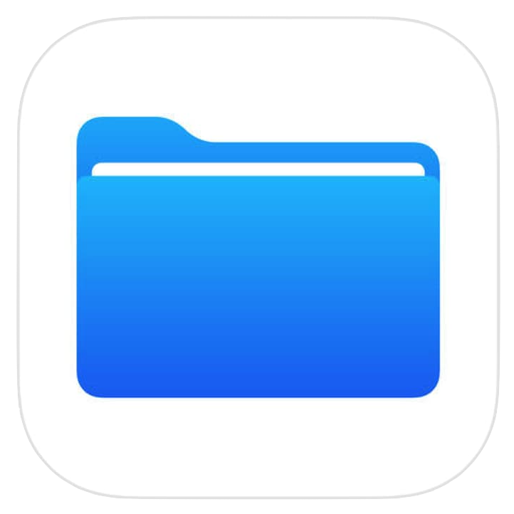

# File Manager



O File Manager é uma aplicação de gerenciamento de arquivos através da internet, baseado em fundamentos de ferramentas "nas", o file-manager-web traz um novo conceito de compartilhamento de dados a fim de tornar sua experiência simples e eficaz. Com recursos intuitivos e uma interface de usuário amigável, o File Manager torna a organização e a busca de arquivos uma tarefa fácil.

## Recursos Principais

- **Navegação Intuitiva:** Navegue facilmente pelo sistema de arquivos com uma interface de usuário intuitiva e amigável.

- **Gerenciamento de Arquivos:** Copie, mova, renomeie e exclua arquivos de maneira simples e eficaz através do controle de permissões de usuários.

- **Pesquisa Rápida:** Encontre rapidamente seus arquivos usando a funcionalidade de pesquisa integrada.

- **Visualização de Arquivos:** Visualize arquivos de texto e imagens diretamente na aplicação.

- **Suporte para Múltiplos Formatos:** O File Manager suporta uma ampla variedade de formatos de arquivo.

## Instalação

1. Clone este repositório em seu computador:
   ```sh
   git clone https://github.com/herick-develop/file-manager.git
